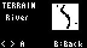

# TinyCity

> TinyCity is a city simulation game inspired by SimCity for the [Raspberry Pi RP2040](https://www.raspberrypi.com/documentation/microcontrollers/silicon.html) running MicroPython

Build and manage a growing metropolis in this tiny city sim. Balance zones and resources, hit milestones to gain bonuses and navigate disasters that are randomly generated.

## Features

- 3 terrains to choose from or a randomly generated map
- Residential, commercial, and industrial zoning
- Budget management
- Population growth & density, power grid, crime and pollution
- Disaster system with random events
- Milestones and hidden bonuses
- Save/load functionality
- Police & fire stations, power plants, stadiums, and more!

## Tips

- Taxes are collected once per year
- Click menu to view current budget and change tax rate
- Add parks, trees and schools to attract new residents
- Add fire and police stations to avoid crime and fight potential fires
- Monitor pollution levels and heavy traffic to improve growth

## How to play
* Play it [online here](https://code.thumby.us/play.html?game=TinyCity) *(available soon once arcade PR is merged!)*
* Add the `src` files to the [Online Editor](https://code.thumby.us)

#### Thanks

TinyCity was _heavily_ inspired by [jhhoward/MicroCity](https://github.com/jhhoward/MicroCity) for the [Arduboy](https://arduboy.com) game platform. Thanks for all of the amazing work on MicroCity (and other titles).
